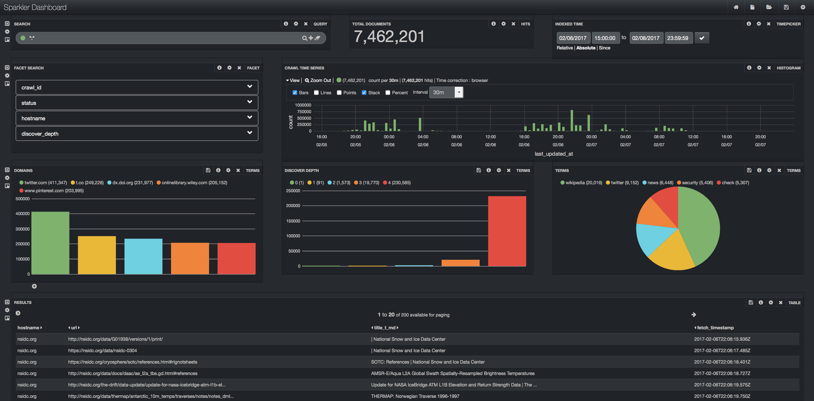

# [Sparkler](http://irds.usc.edu/sparkler/)

<a href="https://uscdatascience.slack.com/messages/sparkler/"></a>
[](https://travis-ci.org/USCDataScience/sparkler)

A web crawler is a bot program that fetches resources from the web for the sake of building applications like search engines, knowledge bases, etc. Sparkler (contraction of Spark-Crawler) is a new web crawler that makes use of recent advancements in distributed computing and information retrieval domains by conglomerating various Apache projects like Spark, Kafka, Lucene/Solr, Tika, and pf4j. Sparkler is an extensible, highly scalable, and high-performance web crawler that is an evolution of Apache Nutch and runs on Apache Spark Cluster.

### NOTE:
~~Sparkler is being proposed to [Apache Incubator](http://incubator.apache.org/). Review the proposal document and provide your suggestions here [here](https://docs.google.com/document/d/1SU0YESlY5JViA9ezCSPr_SSF9e9VuvyFRICupGlfUKs/edit?usp=sharing)~~ Will be done later, eventually!

### Notable features of Sparkler:

* **Provides Higher performance and fault tolerance:** The crawl pipeline has been redesigned to take advantage of the caching and fault tolerance capability of Apache Spark.
* **Supports complex and near real-time analytics:** The internal data-structure is an indexed store powered by Apache Lucene and has the functionality to answer complex queries in near real time. Apache Solr (Supporting standalone for a quick start and cloud mode to scale horizontally) is used to expose the crawler analytics via HTTP API. These analytics can be visualized using intuitive charts in Admin dashboard (coming soon).
* **Streams out the content in real-time:** Optionally, Apache Kafka can be configured to retrieve the output content as and when the content becomes available.
* **Java Script Rendering** Executes the javascript code in webpages to create final state of the page. The setup is easy and painless, scales by distributing the work on Spark. It preserves the sessions and cookies for the subsequent requests made to a host.
* **Extensible plugin framework:** Sparkler is designed to be modular. It supports plugins to extend and customize the runtime behaviour.  
* **Universal Parser:** Apache Tika, the most popular content detection, and content analysis toolkit that can deal with thousands of file formats, is used to discover links to the outgoing web resources and also to perform analysis on fetched resources.

### Quick Start: Running your first crawl job in minutes
To use sparkler, install [docker](https://www.docker.com/community-edition#/download) and run the below commands:

```bash
# Step 0. Get this script
wget https://raw.githubusercontent.com/USCDataScience/sparkler/master/bin/dockler.sh
# Step 1. Run the script - it starts docker container and forwards ports to host
bash dockler.sh 
# Step 2. Inject seed urls
/data/sparkler/bin/sparkler.sh inject -id 1 -su 'http://www.bbc.com/news'
# Step 3. Start the crawl job
/data/sparkler/bin/sparkler.sh crawl -id 1 -tn 100 -i 2     # id=1, top 100 URLs, do -i=2 iterations
```
### Running Sparkler with seed urls file: 
```bash
1. Follow Steps 0-1
2. Create a file name seed-urls.txt using Emacs editor as follows:     
       a. emacs sparkler/bin/seed-urls.txt 
       b. copy paste your urls 
       c. Ctrl+x Ctrl+s to save  
       d. Ctrl+x Ctrl+c to quit the editor [Reference: http://mally.stanford.edu/~sr/computing/emacs.html]

* Note: You can use Vim and Nano editors also or use: echo -e "http://example1.com\nhttp://example2.com" >> seedfile.txt command.

3. Inject seed urls using the following command, 
/sparkler/bin/sparkler.sh inject -id 1 -sf seed-urls.txt
4. Start the crawl job.
```
To crawl until the end of all new URLS, use `-i -1`, Example: `/data/sparkler/bin/sparkler.sh crawl -id 1 -i -1`

Access the dashboard http://localhost:8983/banana/  (forwarded from docker image). 
The dashboard should look like the one in the below:

### Dashboard


### Making Contributions:
 - [To the source code](http://irds.usc.edu/sparkler/dev/development-environment-setup.html#contributing-source)
 - [To the documentation](http://irds.usc.edu/sparkler/dev/contributing-to-docs.html)

### Contact Us

Any questions or suggestions are welcomed in our mailing list [irds-l@mymaillists.usc.edu](mailto:irds-l@mymaillists.usc.edu)
Alternatively, you may use the slack channel for getting help http://irds.usc.edu/sparkler/#slack
